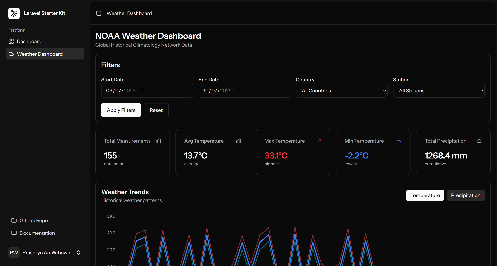
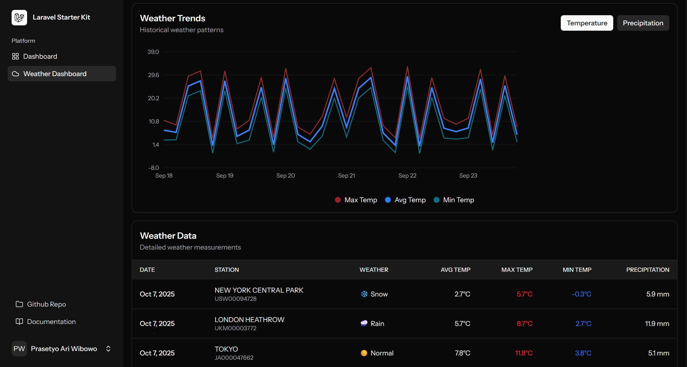
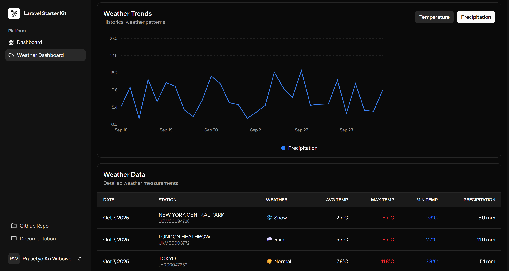
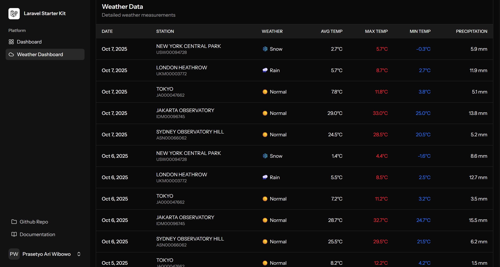

# NOAA Weather Dashboard

Dashboard cuaca interaktif terintegrasi dengan Laravel Vue Starter Kit, menggunakan ClickHouse untuk query data NOAA Global Historical Climatology Network.

## 📸 Screenshots

### Main Dashboard

*Dashboard utama dengan weather summary cards dan recent data*

### Weather Dashboard - Overview

*Weather Dashboard dengan filters, statistics cards, dan charts*

### Weather Dashboard - Data Table

*Detailed data table dengan weather measurements*

### Weather Dashboard - Charts

*Interactive temperature dan precipitation charts*

## 🚀 Tech Stack

- **Backend**: Laravel 12
- **Frontend**: Vue.js 3 + Inertia.js + TypeScript
- **Database**: ClickHouse (OLAP Database)
- **UI**: TailwindCSS + Reka UI (Laravel Vue Starter Kit)
- **Data**: NOAA GHCN (120+ years of weather data)

## 📋 Features

### 🎨 Main Dashboard (Screenshot 1)
✅ **Weather Summary Cards**
- Average Temperature (last 7 days)
- Temperature Range (Max/Min)
- Total Precipitation
- Active Stations

✅ **Recent Weather Data**
- 5 latest measurements
- Quick overview per station

✅ **Quick Actions**
- Link to full Weather Dashboard
- NOAA Documentation
- ClickHouse Playground

### ☁️ Weather Dashboard (Screenshots 2-4)

✅ **Filter berdasarkan Periode**
- Date range picker untuk memilih rentang tanggal
- Data dari 1 Januari 2025 - 7 Oktober 2025 (280 hari)
- Default: 30 hari terakhir

✅ **Filter berdasarkan Wilayah**
- Filter by Country (Indonesia, USA, Japan, UK, Australia)
- Filter by Station (Jakarta, New York, Tokyo, London, Sydney)

✅ **Visualisasi Data**
- 📊 Statistics Cards (Total Measurements, Avg/Max/Min Temperature, Precipitation)
- 📈 Interactive Charts (Temperature & Precipitation trends)
- 📋 Data Table dengan detail lengkap
- 🎨 Color-coded temperatures (red for max, blue for min)
- 🌤️ Weather icons (☀️ Normal, 🌧️ Rain, ❄️ Snow)

✅ **Real-time Query**
- Query super cepat dengan ClickHouse
- Agregasi data dalam milliseconds
- 1,400 rows data (5 stations × 280 days)

## 🛠️ Installation

### Prerequisites

- PHP 8.2+
- Composer
- Node.js 18+
- Docker Desktop (untuk ClickHouse)

### Setup Steps

1. **Clone Repository**
```bash
git clone https://github.com/prassaaa/testCase-Dwara.git
cd testCase-Dwara
```

2. **Install Dependencies**
```bash
composer install
npm install
```

3. **Environment Setup**
```bash
cp .env.example .env
php artisan key:generate
```

4. **Start ClickHouse**
```bash
docker-compose up -d
```

Tunggu beberapa detik hingga ClickHouse selesai initialize dan load sample data.

5. **Verify ClickHouse**
```bash
docker exec clickhouse-server clickhouse-client --query="SELECT count() FROM weather.noaa"
```

Output harus menunjukkan `30` (30 rows sample data).

6. **Build Assets**
```bash
npm run build
# atau untuk development
npm run dev
```

7. **Start Laravel Server**
```bash
php artisan serve
```

8. **Access Application**
- **Welcome Page**: http://localhost:8000
- **Main Dashboard** (requires auth): http://localhost:8000/dashboard
- **Weather Dashboard** (requires auth): http://localhost:8000/weather

## 🎨 Dashboard Integration

Weather Dashboard sudah **terintegrasi penuh** dengan Laravel Vue Starter Kit:

### **Main Dashboard** (`/dashboard`) - 📸 *See Screenshot 1*
- ✅ Weather summary cards (Avg Temp, Temp Range, Precipitation, Active Stations)
- ✅ Recent weather data (last 5 measurements)
- ✅ Quick actions (links to Weather Dashboard, NOAA docs, ClickHouse playground)
- ✅ Real-time data dari ClickHouse
- ✅ Requires authentication

### **Weather Dashboard** (`/weather`) - 📸 *See Screenshots 2-4*
- ✅ Full weather analytics page
- ✅ Advanced filters (date range, country, station) - *Screenshot 2*
- ✅ Interactive charts (temperature & precipitation trends) - *Screenshot 4*
- ✅ Detailed data table - *Screenshot 3*
- ✅ Statistics cards - *Screenshot 2*
- ✅ Requires authentication

### **Navigation**
- Weather Dashboard menu di sidebar (dengan icon Cloud ☁️)
- Quick link dari Main Dashboard ke Weather Dashboard
- Breadcrumb navigation

## 📊 Sample Data

Project ini sudah include sample data dari 5 kota untuk **tahun 2025**:

| Station | Country | Data Period | Total Days | Avg Temp |
|---------|---------|-------------|------------|----------|
| 🇮🇩 Jakarta Observatory | Indonesia | Jan 1 - Oct 7, 2025 | 280 | 28.2°C |
| 🇺🇸 New York Central Park | USA | Jan 1 - Oct 7, 2025 | 280 | 1.7°C |
| 🇯🇵 Tokyo | Japan | Jan 1 - Oct 7, 2025 | 280 | 8.1°C |
| 🇬🇧 London Heathrow | UK | Jan 1 - Oct 7, 2025 | 280 | 5.8°C |
| 🇦🇺 Sydney Observatory Hill | Australia | Jan 1 - Oct 7, 2025 | 280 | 24.7°C |

**Total: 1,400 rows** (5 stations × 280 days)

### Data Measurements:
- 🌡️ Temperature (Avg, Max, Min) in °C
- 💧 Precipitation in mm
- 🌤️ Weather Type (Normal, Rain, Snow)
- 💨 Wind Speed (Average & Max)
- ❄️ Snow data (untuk kota dengan salju)
- 📍 GPS Coordinates & Elevation

*Data dapat dilihat di Screenshots 2-4*

## 🔧 ClickHouse Management

### Access ClickHouse Client
```bash
docker exec -it clickhouse-server clickhouse-client
```

### Useful Queries

**Check data count:**
```sql
SELECT count() FROM weather.noaa;
```

**View recent data:**
```sql
SELECT * FROM weather.noaa_readable 
ORDER BY date DESC 
LIMIT 10;
```

**Statistics by station:**
```sql
SELECT 
    station_name,
    avg(temp_avg_celsius) as avg_temp,
    count() as measurements
FROM weather.noaa_readable
GROUP BY station_name;
```

### Load Full NOAA Dataset (Optional)

Jika ingin load full dataset (2.6 billion rows):

```bash
# Download data (6.4GB)
wget https://datasets-documentation.s3.eu-west-3.amazonaws.com/noaa/noaa_enriched.parquet

# Insert to ClickHouse
docker exec -i clickhouse-server clickhouse-client \
  --query="INSERT INTO weather.noaa FORMAT Parquet" \
  < noaa_enriched.parquet
```

## 🎨 UI Components

### Weather Dashboard Components

- **WeatherFilters.vue** - Filter form (date range, country, station)
- **WeatherStats.vue** - Statistics cards
- **WeatherChart.vue** - Line chart untuk temperature & precipitation
- **WeatherTable.vue** - Data table dengan pagination

### API Endpoints

- `GET /weather` - Dashboard page
- `GET /weather/data` - Get weather data (with filters)
- `GET /weather/statistics` - Get aggregated statistics
- `GET /weather/stations` - Get available stations
- `GET /weather/test-connection` - Test ClickHouse connection

## 🧪 Testing

### Test ClickHouse Connection
```bash
curl http://localhost:8000/weather/test-connection
```

### Test API Endpoints
```bash
# Get weather data
curl "http://localhost:8000/weather/data?start_date=2024-01-01&end_date=2024-01-31"

# Get statistics
curl "http://localhost:8000/weather/statistics?country=ID"

# Get stations
curl http://localhost:8000/weather/stations
```

## 📁 Project Structure

```
testCase-Dwara/
├── app/
│   ├── Http/Controllers/
│   │   └── WeatherDashboardController.php
│   └── Services/
│       └── ClickHouseService.php
├── clickhouse/
│   ├── init/
│   │   ├── 01-create-table.sql
│   │   └── 02-insert-sample-data.sql
│   └── README.md
├── config/
│   └── clickhouse.php
├── resources/
│   └── js/
│       ├── components/
│       │   └── weather/
│       │       ├── WeatherFilters.vue
│       │       ├── WeatherStats.vue
│       │       ├── WeatherChart.vue
│       │       └── WeatherTable.vue
│       └── pages/
│           └── WeatherDashboard.vue
├── docker-compose.yml
└── README.md
```

## 🐛 Troubleshooting

### ClickHouse tidak bisa connect
```bash
# Check container status
docker-compose ps

# Check logs
docker-compose logs clickhouse

# Restart container
docker-compose restart clickhouse
```

### Build error (lightningcss/oxide)
```bash
npm install lightningcss-win32-x64-msvc --save-optional
npm install @tailwindcss/oxide-win32-x64-msvc --save-optional
npm run build
```

### No data showing
```bash
# Verify data exists
docker exec clickhouse-server clickhouse-client \
  --query="SELECT count() FROM weather.noaa"

# Re-run init scripts
docker-compose down -v
docker-compose up -d
```

## � Visual Guide

### Dashboard Flow

1. **Login Page** → Login dengan credentials Anda
2. **Main Dashboard** (Screenshot 1) → Lihat weather summary & recent data
3. **Weather Dashboard** (Screenshot 2) → Apply filters (date, country, station)
4. **View Charts** (Screenshot 4) → Analyze temperature & precipitation trends
5. **View Data Table** (Screenshot 3) → Explore detailed measurements

### Screenshot Details

| Screenshot | Page | Features Shown |
|------------|------|----------------|
| **dashboard1.png** | Main Dashboard | Summary cards, Recent data, Quick actions |
| **dashboard2.png** | Weather Dashboard | Filters, Statistics cards, Overview |
| **dashboard3.png** | Weather Dashboard | Detailed data table with measurements |
| **dashboard4.png** | Weather Dashboard | Interactive temperature & precipitation charts |

## �📚 Resources

- [ClickHouse Documentation](https://clickhouse.com/docs)
- [NOAA GHCN Dataset](https://clickhouse.com/docs/getting-started/example-datasets/noaa)
- [Laravel Documentation](https://laravel.com/docs)
- [Vue.js Documentation](https://vuejs.org/)
- [Inertia.js Documentation](https://inertiajs.com/)
